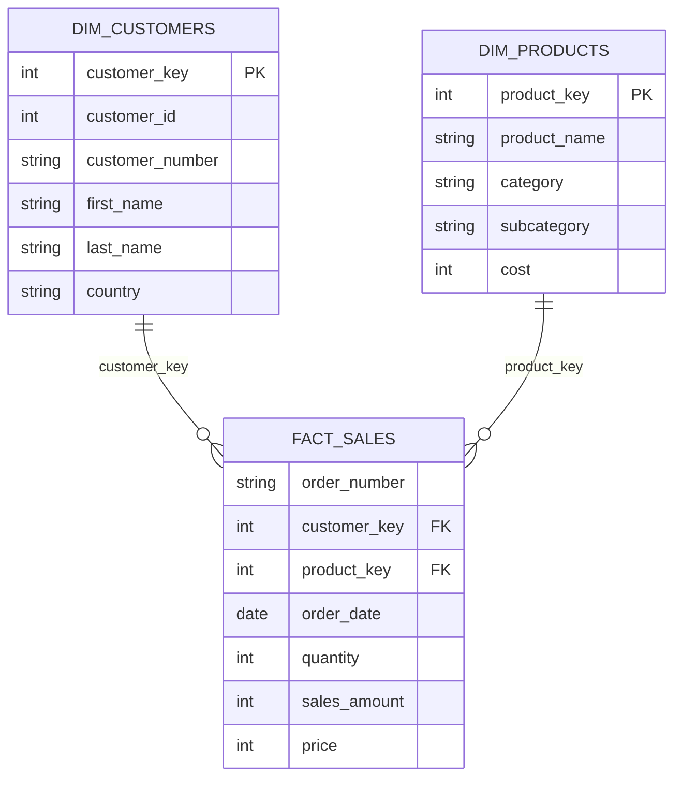

# SQL-Retail Sales Exploratory Analysis
SQL Exploratory Data Analysis (EDA) project using PostgreSQL to examine retail sales data, assess data quality, identify trends, and uncover business insights through SQL.

## Table of Contents

1. Project Overview
2. Business Problem
3. Objectives
4. Dataset Overview
5. Database Schema
6. Tools Used
7. Skills Demonstrated
8. Exploratory Data Analysis
9. Business Questions Explored
10. SQL Techniques Used
11. Key Findings
12. Project Setup
13. Repository Structure

---

## 1. Project Overview

Retail organizations generate large volumes of transactional data every day. Before performing advanced analytics or building business reports, it is essential to understand the structure, quality, and characteristics of the data.

This project performs Exploratory Data Analysis (EDA) using PostgreSQL to investigate customer, product, and sales data. The analysis focuses on validating data quality, identifying trends, exploring distributions, and uncovering meaningful insights that support future analytical and business decisions.

---

## 2. Business Problem

Raw transactional datasets often contain hidden patterns, inconsistencies, and quality issues that can impact business decisions.

Before performing customer analytics or reporting, organizations need answers to questions such as:

- Is the data complete and reliable?
- How are sales distributed over time?
- Which products and categories dominate the business?
- How do customers differ across countries and demographics?
- Are there any unusual trends or anomalies?
- What characteristics should be considered before deeper analysis?

This project answers these questions using SQL-based exploratory data analysis.

---

## 3. Objectives

- Explore the overall database structure and schema.
- Understand customer and product dimensions.
- Analyze the historical sales timeframe.
- Evaluate key business measures and performance metrics.
- Assess the magnitude and distribution of business entities.
- Identify top and bottom performing customers, products, and categories.
- Establish a strong analytical foundation for advanced business reporting and analytics.

---

## 4. Dataset Overview

The project uses a retail sales database consisting of three related tables.

| Table | Description |
|-------|-------------|
| `gold.dim_customers` | Customer demographic information including customer details, gender, country, and account creation date. |
| `gold.dim_products` | Product information including product name, category, subcategory, product line, and cost. |
| `gold.fact_sales` | Transaction-level sales records linking customers and products, including order details, quantity sold, price, and sales amount. |

---

## 5. Database Schema

The project uses a **star schema** consisting of one fact table (`fact_sales`) and two dimension tables (`dim_customers` and `dim_products`).

- `dim_customers` stores customer demographic information.
- `dim_products` stores product details and categories.
- `fact_sales` records transaction-level sales and links customers with products through foreign keys.



---

## 6. Tools Used

- PostgreSQL
- SQL
- pgAdmin
- Aggregate Functions
- Date Functions
- Common Table Expressions (CTEs)

---

## 7. Skills Demonstrated

- Exploratory Data Analysis (EDA)
- Data Profiling
- Data Validation
- Database Exploration
- SQL Joins
- Aggregate Functions
- CASE Statements
- Common Table Expressions (CTEs)
- Window Functions
- Ranking Functions
- Date Functions
- Business Data Exploration
- Analytical Reporting

---

## 8. Exploratory Data Analysis

The project investigates the retail sales database through six structured exploratory questions:

### 1. Understanding the Database Structure
- Explore database schemas, tables, and columns.
- Examine table relationships and available data assets.

### 2. Understanding Customer and Product Dimensions
- Analyze customer demographics and geographic distribution.
- Explore product categories, subcategories, and hierarchy.

### 3. Understanding the Sales Timeframe
- Identify historical sales coverage.
- Analyze customer registration periods.
- Explore customer age distribution.
- Examine yearly order trends.

### 4. Understanding Key Business Measures
- Calculate revenue, orders, quantity sold, average selling price, and product statistics.
- Generate consolidated business KPIs.

### 5. Understanding Business Magnitude
- Analyze customer distribution across countries.
- Explore product distribution by category.
- Evaluate revenue by category.
- Measure purchasing frequency and product demand.

### 6. Identifying Top and Bottom Performers
- Top customers by revenue.
- Bottom customers by revenue.
- Best-selling products.
- Lowest-performing products.
- Highest revenue-generating categories.

---

## 9. Business Questions Explored

- What tables and schemas exist in the database?
- What customer and product information is available?
- What is the historical period covered by the sales data?
- How many customers, products, orders, and transactions exist?
- Which countries contribute the largest customer base?
- Which product categories dominate the catalog?
- What are the key business measures available for analysis?
- Which customers generate the highest revenue?
- Which products perform the best and worst?
- Which product categories contribute the most revenue?

---

## 10. SQL Techniques Used

- SELECT
- WHERE
- ORDER BY
- GROUP BY
- HAVING
- CASE
- JOINS
- Aggregate Functions
- Date Functions
- CTEs
- COUNT()
- SUM()
- AVG()
- MIN()
- MAX()

---

## 11. Key Findings

- The retail sales database follows a well-structured star schema consisting of one fact table and two dimension tables.
- The dataset spans multiple years, making it suitable for trend and time-series analysis.
- Customer records include demographic attributes that support segmentation and profiling.
- Product information is organized into categories and subcategories, enabling hierarchical analysis.
- Key business measures provide a comprehensive overview of sales performance and business scale.
- Revenue generation is concentrated among a subset of products and customer segments.
- Ranking analysis successfully identifies high-performing and low-performing customers and products.
- The dataset is complete and well-structured, providing a strong foundation for advanced analytics, dashboard development, and business reporting.

---

## NOTE

1. Clone the repository.
2. Create the PostgreSQL database.
3. Execute the database creation script.
4. Import the CSV files.
5. Run the SQL analysis script.

---

Repository Structure

```text
sql-retail-sales-exploratory-analysis/
│
├── datasets/
│   ├── dim_customers.csv
│   ├── dim_products.csv
│   └── fact_sales.csv
│
├── README.md
└── retail_sales_exploratory_analysis.sql
```


