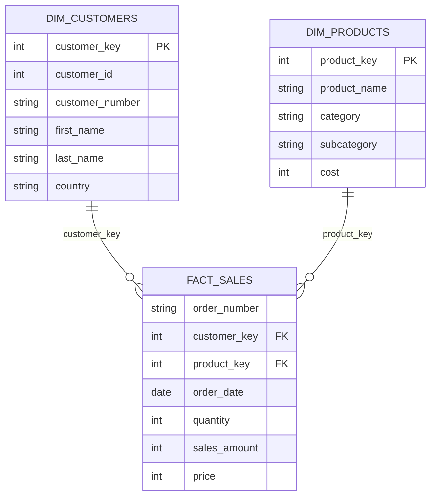

# SQL-Retail Sales Exploratory Analysis
SQL Exploratory Data Analysis (EDA) project using PostgreSQL to examine retail sales data, assess data quality, identify trends, and uncover business insights through SQL.

## Table of Contents

1. Project Overview
2. Business Problem
3. Objectives
4. Dataset Overview
5. Database Schema
6. Tools Used
7. Skills Demonstrated
8. Exploratory Data Analysis
9. Business Questions Explored
10. SQL Techniques Used
11. Key Findings
12. Project Setup
13. Repository Structure

---

## 1. Project Overview

Retail organizations generate large volumes of transactional data every day. Before performing advanced analytics or building business reports, it is essential to understand the structure, quality, and characteristics of the data.

This project performs Exploratory Data Analysis (EDA) using PostgreSQL to investigate customer, product, and sales data. The analysis focuses on validating data quality, identifying trends, exploring distributions, and uncovering meaningful insights that support future analytical and business decisions.

---

## 2. Business Problem

Raw transactional datasets often contain hidden patterns, inconsistencies, and quality issues that can impact business decisions.

Before performing customer analytics or reporting, organizations need answers to questions such as:

- Is the data complete and reliable?
- How are sales distributed over time?
- Which products and categories dominate the business?
- How do customers differ across countries and demographics?
- Are there any unusual trends or anomalies?
- What characteristics should be considered before deeper analysis?

This project answers these questions using SQL-based exploratory data analysis.

---

## 3. Objectives

- Explore the retail sales database
- Assess data quality
- Understand customer demographics
- Analyze product information
- Explore sales trends
- Identify business patterns
- Prepare the dataset for advanced analytics

---

## 4. Dataset Overview

The project uses a retail sales database consisting of three related tables.

| Table | Description |
|-------|-------------|
| `gold.dim_customers` | Customer demographic information including customer details, gender, country, and account creation date. |
| `gold.dim_products` | Product information including product name, category, subcategory, product line, and cost. |
| `gold.fact_sales` | Transaction-level sales records linking customers and products, including order details, quantity sold, price, and sales amount. |

---

## 5. Database Schema

The project uses a **star schema** consisting of one fact table (`fact_sales`) and two dimension tables (`dim_customers` and `dim_products`).

- `dim_customers` stores customer demographic information.
- `dim_products` stores product details and categories.
- `fact_sales` records transaction-level sales and links customers with products through foreign keys.



---

## 6. Tools Used

- PostgreSQL
- SQL
- pgAdmin
- Aggregate Functions
- Date Functions
- Common Table Expressions (CTEs)

---

## 7. Skills Demonstrated

- Data Exploration
- Data Validation
- Data Profiling
- Aggregate Analysis
- SQL Joins
- GROUP BY
- CASE Statements
- Date Functions
- Common Table Expressions (CTEs)
- Business Data Understanding

---

## 8. Exploratory Data Analysis

The project explores:

- Database structure
- Customer data
- Product data
- Sales transactions
- Data completeness
- Missing values
- Duplicate records
- Sales distribution
- Customer distribution
- Product distribution
- Revenue trends

---

## 9. Business Questions Explored

- How many customers, products, and transactions exist?
- What is the sales date range?
- Which countries have the most customers?
- Which product categories contain the most products?
- Which products generate the highest revenue?
- Are there missing or duplicate records?
- How are sales distributed over time?

---

## 10. SQL Techniques Used

- SELECT
- WHERE
- ORDER BY
- GROUP BY
- HAVING
- CASE
- JOINS
- Aggregate Functions
- Date Functions
- CTEs
- COUNT()
- SUM()
- AVG()
- MIN()
- MAX()

---

## 11. Key Findings

- Customer and product information were successfully explored and validated.
- Sales data covers multiple product categories and customer locations.
- Revenue is concentrated within a subset of products and categories.
- Exploratory analysis identified important business patterns for further analytics.
- The dataset is suitable for advanced customer and sales analysis.

---

## NOTE

1. Clone the repository.
2. Create the PostgreSQL database.
3. Execute the database creation script.
4. Import the CSV files.
5. Run the SQL analysis script.

---

Repository Structure

```text
sql-retail-sales-exploratory-analysis/
│
├── datasets/
│   ├── dim_customers.csv
│   ├── dim_products.csv
│   └── fact_sales.csv
│
├── README.md
└── retail_sales_exploratory_analysis.sql
```


